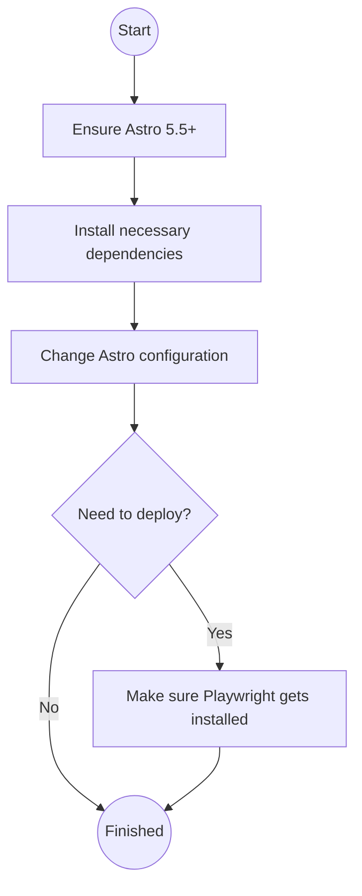

<Info icon={false}>
* [mermaid][1] is a library that allows you to create a variety of diagrams and charts with a relatively simple markdown syntax
* [Astro][2] is a web framework to build static sites as well as sites with interaction islands. Think Jekyll, but for 2025.
</Info>

The [release notes of Astro 5.5][3] explicitly mentioned that it should now be much easier to integrate mermaid-based
diagramming into Astro sites, which immediately peaked my interest as this was something I thought of as nice-to-have
to support some technical discussion e.g. with a flowchart or a sequence diagram.

Setting it up was not that difficult, yet it still presented me with some gotchas that you may also trip over as a novice
in those particular technologies. Hence this post essentially serves as a documentation what I had to do.
Let's start with an overview:



## Ensure Astro 5.5+

Piece of cake (assuming you already have an Astro site going):
```bash
npx @astrojs/upgrade
```

## Install necessary dependencies

The following packages were relevant:

```json title="package.json" ins={5-6}
  "dependencies": {
    "astro": "^5.5.3",
    "@astrojs/mdx": "^4.2.1",
    "...": "...",
    "playwright": "^1.51.1",
    "rehype-mermaid": "^3.0.0"
  }
```

[playwright][5] is apparently necessary to be able to create the images generated from mermaid markdown statically, i.e.
not directly in the browser of the visitor hitting realfiction.net. 

Also, make sure playwright can work correctly:

```bash
npx playwright install --with-deps chromium
```

## Change Astro configuration

Time to touch the site's configuration:

```javascript title="astro-config.mjs" ins={1,8,10}
import rehypeMermaid from "rehype-mermaid";

export default defineConfig({
  ...
  markdown: {
    syntaxHighlight: {
      type: "shiki",
      excludeLangs: ["mermaid"]
    },
    rehypePlugins: [[rehypeMermaid, { strategy: "img-svg", dark: true, colorScheme: "forest" }]]
  },
  integrations: [
    ...
    mdx(),
    sitemap(),
  ],
});

```

Check out the [rehype mermaid repo][4] to see what options are available to you.

## Deployment? Make sure Playwright gets installed correctly

The final stumbling block was the actual deployment that I do via github actions. Here it is necessary to also ensure
that playwright will work correctly.

```yaml title="deploy.yml" ins={7-8}
jobs:
  build:
    runs-on: ubuntu-latest
    steps:
      - name: Checkout your repository using git
        uses: actions/checkout@v4
      - name: Get playwright for mermaid stuff
        run: npx playwright install --with-deps chromium
      - name: Install, build, and upload your site
        uses: withastro/action@v2
```

## Conclusion

and this is pretty much it! Of course the generated diagrams may not win beauty contests, but dark mode is supported
and it is a pretty easy workflow to eg tell chat gpt to make some mermaid workflow from an informal description and then 
paste the text here. Btw, the above workflow looks like this in the _source code_:

````

````

[1]: https://mermaid.js.org
[2]: https://astro.build
[3]: https://astro.build/blog/astro-550/
[4]: https://github.com/remcohaszing/rehype-mermaid
[5]: https://playwright.dev
