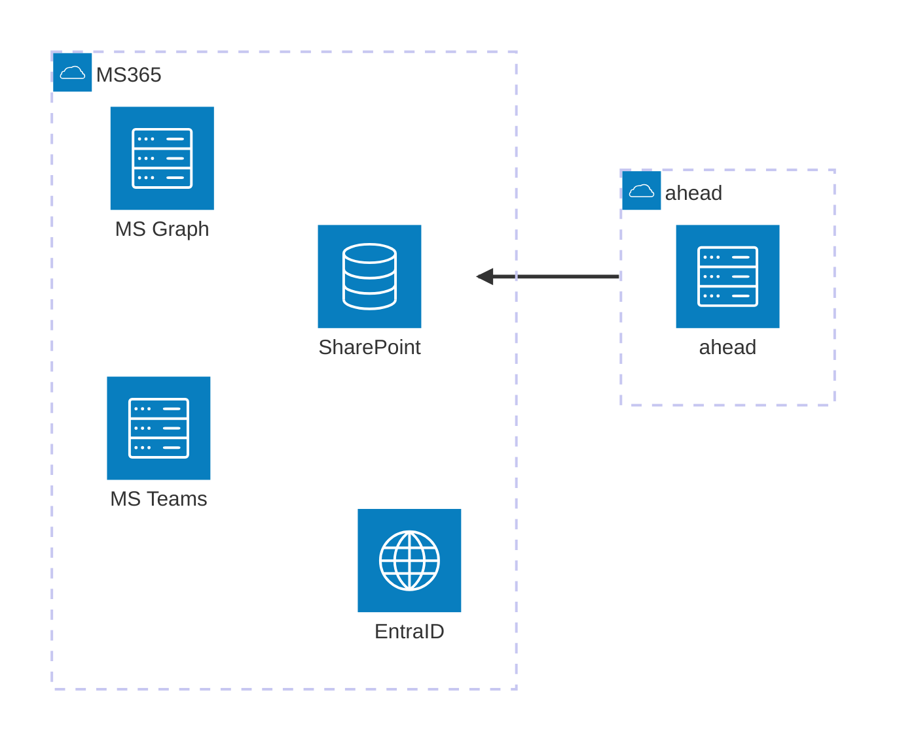

Before exploring how a SaaS product like ahead could reduce its reliance on Azure services, 
it is crucial to consider its historical ties to Microsoft's ecosystem.

MS365 services around SharePoint, MS Teams, and identity services via EntraID (formerly known as Azure AD) 
are well integrated into our product. 
What is more, many customers may store sensitive information in a service like SharePoint or MS Teams. 
Migrating away is also no easy feat as collaboration platforms with a similar breadth and depth of features are rare.

<figcaption>MS365 services form the backbone of many enterprise environments</figcaption>

Even before recent events, the [US cloud act][1] gives US authorities the right to access data of US-based
companies, **even if the data resides outside of the US**. 
Microsoft states that it will legally challenge any attempt to enforce this rule [as seen here][2] (article in German). 
Even so, with times changing one can ask whether this stance will be upheld with mounting pressure from a government that is becoming more authoritarian.

## What is in scope?

In any case, our product also stores data where we have more freedom to choose where that data may reside in the future.
We also have the flexibility in choosing the **architectural building blocks** that power our features.

Things that we require are (by no means a complete list)

* OpenID-compatible authentication 
* _load breakers_ in the form of _queues_ as well as _events_ to be handled by background processes
* _realtime messaging_ capabilities to our connected users
* Graph database storage compatible with the _gremlin graph querying language_
* _Document database_ storage
* _Blob_ storage for unstructured data and files
* Storage of _analytics_ data
* _Delayed_ actions as well as _scheduled_ actions

This is just a starting point. The following posts will look at those requirements in turn and will attempt to solve
them in the context of a .NET application.

<TopicToc topicId="azure-ahead" active="Depending on a colour Pt. 2 - Needs, Possibilities and Limitations" />

[1]: https://en.wikipedia.org/wiki/CLOUD_Act
[2]: https://news.microsoft.com/de-de/im-daten-dschungel-wie-microsoft-mit-dem-cloud-act-umgeht/