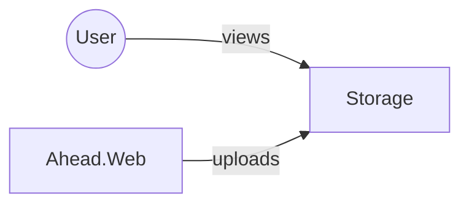
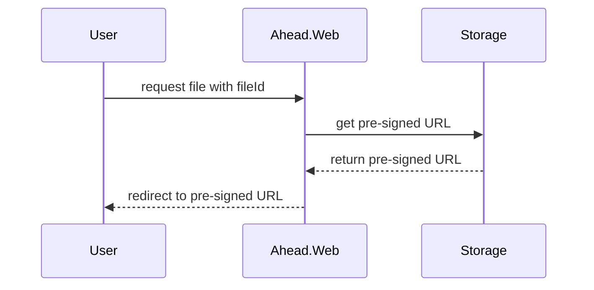

<TopicToc 
    title="Cloud agnostic series" 
    topicId="azure-ahead" 
    active="Cloud Agnostic - Storing & serving files"
    closed
 />

Let us start with a relatively simple, ubiquitous but necessary service: _Storage of files_. In ahead these are
needed for attachments, images, videos and the like.

After investigating a bit, it appears that the safest bet here is to use something that is **Amazon S3**-compatible.
AWS, by being first here, essentially set the standard for cloud storage, and many companies will offer such 
"S3-compatible" storage for you to use. [Here's an example from Switzerland][1].

Granted, using Azure Blob Storage is straightforward from a developer perspective: Having a local "emulator"
is as easy as saying `npm install azurite`. I could imagine that there might be a similar
offering for S3-compatible storage, but considering that I have an Aspire-project available, 
setting up a container is also a straightforward activity. The company [min.io][2] offers an "object store"
that can be run at hyperscale as well as locally on a Docker container. The relevant code is [hosted at github][3]

Defining such a container as a resource in Aspire looks like this:

<GHEmbed showHint repo="ahead-dockerized" branch="snapshot_1" file="AppHost/Program.cs" start={10} end={19} />

People who know docker containers probably recognize the different settings that are being applied:

* 2 environment variables that define the admin user with which we can log in at min.io's dashboard (port 9090)
* port bindings
* volume bindings
* startup arguments

Aspire gives you a fluent API to define settings on the different kind of resources. Interesting are also the
two variables `minioUser`, `minioPassword` which are defined further up: 

<GHEmbed repo="ahead-dockerized" branch="snapshot_1" file="AppHost/Program.cs" start={7} end={8} />

During development, these values come from a "Parameters" section in `appSettings.Development.json`.
Once I start the solution by running the `AppHost` Aspire project, I can access the min.io dashboard by 
clicking the provided link in the Aspire dashboard:

<figcaption>Aspire Dashboard showing the known resources</figcaption>

In the dashboard I can log in with the provided user / password values and create an access key:

<figcaption>min.io console that allows to create access keys</figcaption>

These will be required when accessing the service.

<GHEmbed repo="ahead-dockerized" branch="snapshot_1" file="Ahead.Web/Infrastructure/IBlobStorage.cs" start={77} end={81} />

The relevant Nuget to access the service is simply called **minio**, and provides an up-to-date library to talk to
min.io (and by extension S3 compatible) services.

The `Ahead.Dockerized` solution introduces a blob storage interface with some example API that is linked to UI in order to be able to use it:

<GHEmbed repo="ahead-dockerized" branch="snapshot_1" file="Ahead.Web/Infrastructure/IBlobStorage.cs" start={9} end={14} />

<Info>
This example solution does not implement 
multi-tenancy as this is mostly an application aspect independent of the used resources and is therefore not in the focus of this solution.
E.g. `bucketName` would be derived from the tenant used in the current scope.
</Info>

⬇️ This is the implementation of the upload – it takes an `IFormFile` instance and stores it in the service.
I found it amusing that, just coming from an Aspire frontend, I ended up using a fluent interface _again_.
While they're kind of nice to read, getting there is not always as obvious as one cannot see from the API what is 
mandatory vs what is not, hence it is sometimes something of a trial and error to get the right incantation.

<GHEmbed repo="ahead-dockerized" branch="snapshot_1" file="Ahead.Web/Infrastructure/IBlobStorage.cs" start={31} end={44} />

Another thing I wanted to check out is the signed url functionality. 
Links to files in ahead are usually written like `api/files/{fileId}` — the server then redirects to a signed url, 
which lets you see the file for a limited amount of time:

This is how to get the necessary url:

<GHEmbed repo="ahead-dockerized" branch="snapshot_1" file="Ahead.Web/Infrastructure/IBlobStorage.cs" start={46} end={55} />

In this case, the link expires after one hour.

All in all, blob storage is, as expected, one of the easier things to treat in a cloud-agnostic way.

[1]: https://flow.swiss/object-storage
[2]: https://min.io
[3]: https://github.com/minio/