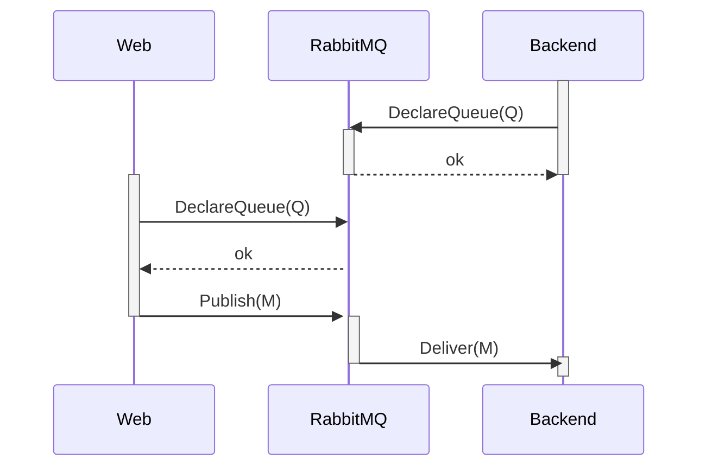

<TopicToc 
    title="Cloud agnostic series" 
    topicId="azure-ahead" 
    active={frontmatter.title}
    closed
 />

Sending messages between processes is an ubiquitous pattern that has been in use for many decades - as such,
the available alternatives are plenty. 

In the past I have only heard good things about [RabbitMQ][1]. What I did not know before I looked at it is
that it is able to cover both our Inter-process communication (**IPC**) requirements by using queues as well as providing
a publish / subscribe model.

## RabbitMQ as an Aspire resource

Support to use RabbitMQ within an Aspire solution is done via the `Aspire.Hosting.RabbitMQ` nuget package:

<GHEmbed showHint repo="ahead-dockerized" branch="snapshot_1" file="AppHost/Program.cs" start={20} end={22} />

This references two secrets that are defined as `ParameterResource`s:

<GHEmbed repo="ahead-dockerized" branch="snapshot_1" file="AppHost/Program.cs" start={6} end={7} />

All of this gets referenced by our two projects **Web** and **Backend** (here exemplified with the Backend project).

<GHEmbed repo="ahead-dockerized" branch="snapshot_1" file="AppHost/Program.cs" start={33} end={37} />

I only learned of `WaitFor` a little bit later - which is a very practical way to ensure 
that an infrastructure resource like RabbitMQ is already available once our own code starts running.

For our playground, I chose sending a queue message for triggering the **making of a report** and a **page published** _event_
that in our real system is handled by multiple consumers to perform a number of tasks of which two here are exemplified.

<Info>
### A word about RabbitMQ
From the time I've had to look into RabbitMQ, it appears to be a Swiss army knife of messaging. 
* Queues can take many forms (temporary or well-known, persistent or transient)
* Exchanges can be defined and on top of this different strategies can be used to get the message as often and to as many locations as necessary.

If you have IPC demands maybe even between processes written in different programming languages, I suggest that you take a look at RabbitMQ,
chances are that it will be able to cover your particular scenarios as it provides clients for a multitude of different environments.

The relevant .NET-specific documentation [can be found here][2].
</Info>

## Using queues

Queues are a very useful pattern to offload work to a different process as well as helping to ensure that your
compute resources don't get overwhelmed, as you have control over how many "workers" may dequeue messages.


<figcaption>Queues as a way to pass a message to a different process and control the workload at any given time</figcaption>

When using RabbitMQ, we should declare the queue we want to use from "both sides", after which we can perform en- & dequeue operations:


<figcaption>Declaring Queues is an idempotent operation and is used by "both sides" to ensure a queue</figcaption>

In order to use RabbitMQ, I used the `Aspire.RabbitMQ.Client.v7` Nuget, and ensure that it gets set up correctly
by adding it to the Services in `Program.cs`:

```csharp
builder.AddRabbitMQClient(connectionName: "messaging");
```

The name `messaging` is related to how we defined the resource in the **Aspire** project (see above). By letting our projects
reference the resource, the correct information to correctly set up a client is injected into our projects.


## Enqueueing

Ahead.Web registers a `QueueSender` at startup with the following shape:

```csharp
public class QueueSender(IConnection connection, ILogger<QueueSender> logger) {
    public async Task Send<T>(string queueName, T message)
}
```

Pretty much everything we want to do with RabbitMQ appears to have to be done with a `Channel`:

<GHEmbed repo="ahead-dockerized" branch="snapshot_1" file="Ahead.Web/Infrastructure/QueueSender.cs" start={15} end={21} />

In this demo solution I did not bother making anything from RabbitMQ persistent, hence we do not have to ask for persistence guarantees.
Note that…

> An exclusive queue can only be used (consumed from, purged, deleted, etc) by its declaring connection

so that would be the wrong thing to use here. The passed in message gets serialized to a **byte array**
(by serializing the message as JSON stored in a variable named `body`) and sent to the queue:

<GHEmbed repo="ahead-dockerized" branch="snapshot_1" file="Ahead.Web/Infrastructure/QueueSender.cs" start={32} end={35} />

## Dequeueing

A similar helper, but for dequeueing, is defined in the `Ahead.Backend` project and looks like this:

```csharp
public class QueueListener<T>(IConnection connection, ILogger<QueueListener<T>> logger)
{
    public async IAsyncEnumerable<T> StartListening(
        string queueName,
        [EnumeratorCancellation] CancellationToken cancellationToken = default)
}
```

The `IAsyncEnumerable` needs to be built with the aid of the RabbitMQ client library and the trusty
`Channel` abstraction that .NET provides:

<GHEmbed repo="ahead-dockerized" branch="snapshot_1" file="Ahead.Backend/Infrastructure/QueueListener.cs" start={18} end={22} />

Once more we declare the queue in much the same way as we did on the sending part.

Then we build a so-called consumer that allows us to provide a callback when something is being received:

<GHEmbed repo="ahead-dockerized" branch="snapshot_1" file="Ahead.Backend/Infrastructure/QueueListener.cs" start={28} end={29} />
<figcaption>I am trying to remember why I called the main input to the handling callback "ea" – bad name!</figcaption>

At the core of the handler we deserialize the message and pass it to the Writer part of a `Channel` instance.

<GHEmbed repo="ahead-dockerized" branch="snapshot_1" file="Ahead.Backend/Infrastructure/QueueListener.cs" start={37} end={43} />

In order to satisfy the signature of the method, we use the `Reader` part of the `Channel`:

<GHEmbed repo="ahead-dockerized" branch="snapshot_1" file="Ahead.Backend/Infrastructure/QueueListener.cs" start={52} end={57} />

_line 52_ also shows how the consumer is associated with the particular queue name.

Given all this Infrastructure we can enqueue a message like

```csharp
routeBuilder.MapGet("/report", async (QueueSender sender, TimeProvider timeProvider) =>
{
    await sender.Send(
        Constants.QueueNames.Basic,
        new ReportRequest
        {
            Type = "onboarding",
            RelevantDate = timeProvider.GetUtcNow().Date
        });

    return Results.Extensions.BackToHomeWithMessage("Report sent!");
});
```

and dequeue it as 

```csharp
await foreach (var reportRequest in queue.StartListening(Constants.QueueNames.Basic, cancellationToken))
                logger.LogInformation(
                    "Report request of type {reportType} received for date {reportDate}", 
                    reportRequest.Type,
                    reportRequest.RelevantDate);
```

Let's put a ✅ on queueing, next will be publishing messages to which others may subscribe.

[1]: https://www.rabbitmq.com
[2]: https://www.rabbitmq.com/tutorials/tutorial-one-dotnet