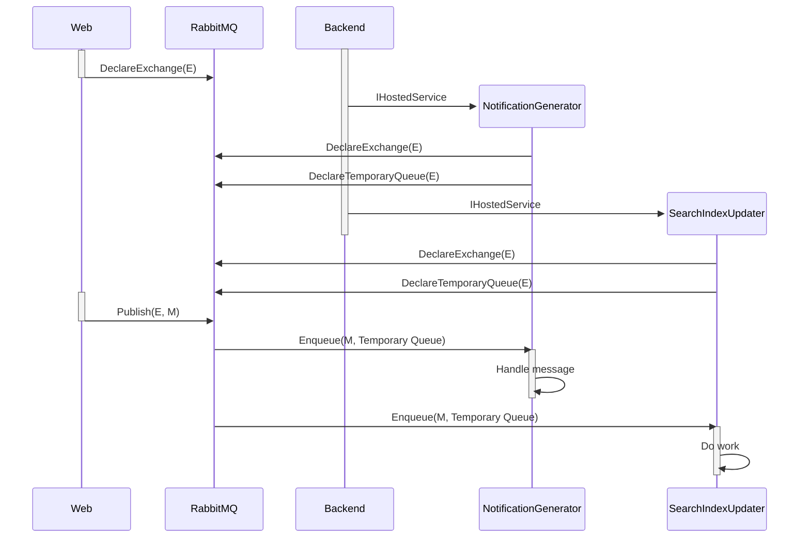

<TopicToc 
    title="Cloud agnostic series" 
    topicId="azure-ahead" 
    active={frontmatter.title}
    closed
 />

Time to look at the second messaging pattern. A message can have the notion of an _event_, 
where you want several systems to be _notified_.

RabbitMQ's approach here is to declare an **Exchange**. Every participant interested in messages posted to said exchange 
create a **non-persistent, temporary queue** tied to said exchange and dequeue incoming messages to handle them.

The following sequence diagram shows what happens, based on the example outlined in the [Ahead.Dockerized solution][3].


<figcaption>
In real life, our _"Backend"_ is an azure functions host project. As such, it comes with many affordances
like easy binding to queues on a function/endpoint level.
This is represented here by `IHostedService` instances that run throughout the lifetime of the process.
</figcaption>

The so-called `BroadcastSender` is fairly similar to the queue sender:

```csharp
public class BroadcastSender(IConnection connection, ILogger<BroadcastSender> logger)
{
    public async Task Send<T>(string broadcastExchange, T message)
}
```

Then we declare the exchange to be used:

<GHEmbed showHint repo="ahead-dockerized" branch="snapshot_1" file="Ahead.Web/Infrastructure/BroadcastSender.cs" start={15} end={15} />

And use the channel once more to publish, this time with a specific `PublicationAddress`.

<GHEmbed repo="ahead-dockerized" branch="snapshot_1" file="Ahead.Web/Infrastructure/BroadcastSender.cs" start={26} end={29} />

This class is then used in the following way:

```csharp title="Publish event"
routeBuilder.MapGet("/publish", async (BroadcastSender sender, Random random) =>
{
    await sender.Send(
        Constants.BroadcastExchanges.UserEvents,
        new PagePublishedEvent(random.Next(1, 1000).ToString()));
    return Results.Extensions.BackToHomeWithMessage("Page has been published!");
});
```

In the `Backend` the `BroadcastListener` also exposes a method to obtain an `AsyncEnumerable` (done again with a `Channel`).

The one major difference is the way we set up the queue that is being used.

<GHEmbed repo="ahead-dockerized" branch="snapshot_1" file="Ahead.Backend/Infrastructure/BroadcastListener.cs" start={22} end={26} />

declaring a queue without any parameters basically makes this a transient queue, with a randomly assigned name which 
we can pick up via `tmpQueue.QueueName`

Via injection we can then consume the same message in multiple places, for example like so:

```csharp
public class SearchIndexUpdater(
    BroadcastListener<PagePublishedEvent> eventBroadcast, 
    ILogger<SearchIndexUpdater> logger) : IHostedService
{
    public Task StartAsync(CancellationToken token)
    {
        logger.LogInformation("Starting Search index updater");
        _ = Task.Run(async () =>
        {
            await foreach (var publishedEvent in eventBroadcast.StartListening(
                    Constants.BroadcastExchanges.UserEvents, 
                    nameof(SearchIndexUpdater), token))
                logger.LogInformation(
                    "Received page published event for page id {pageId}, will update the search index",
                    publishedEvent.PageId);
        }, token);
        return Task.CompletedTask;
    }

    public Task StopAsync(CancellationToken cancellationToken) => Task.CompletedTask;
}
```

With those infrastructure pieces in place, we leave the lovely world of message-passing with RabbitMQ.

[3]: https://github.com/flq/ahead-dockerized